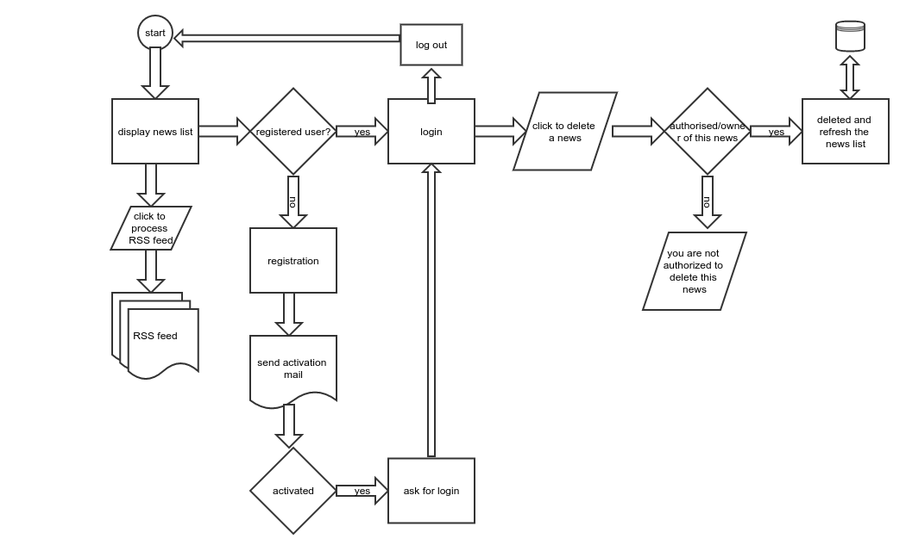

##News Publication
####Objective
   This is a public news publishing portal where news can be published and disseminated by RSS.
 ####Functional Specifications
   Create a public news publishing system where people can report or read news
   News publishing web application
   1. Any user could register with an email address. The application sends a verification link to the email address. When the user clicks the link, the application asks for a new password (can be tested on localhost w/o need for a public domain). Now the user is registered and is able to publish news. Without this verification user cannot publish news.
   2. After log in the user could see his own published news list, remove or publish a new article. No edit of news is permitted.
   3. For each news article the following information is required
   News title
   A single photo
   News text
   Current date and time
   Reporter user name / email
   4. Newsstand web application available w/o log in for general public
   Users could see the news highlights. Latest 10 news only.
   Upon clicking an article highlight, the user is able to view a complete article.
   The user is able to download a PDF file of the displayed news article.
   5. A News RSS feed service
   An RSS feed can be subscribed to, which includes latest 10 news articles.

####Technology used
PHP 7/5.6, MySql >=5.5, Ubuntu Linux, Apache 2.4, Laravel 5.3

PSR 4 standard code.

Also used few libraries needed to prepare this application quickly and correctly like Auth, mailer, phpunit etc.

---
####How to run
After download the whole application and set into document root. You need to config following files :
1. config/app.php
2. config/database.php
3. config/mail.php
4. .env
Then run into browser as per your application url.

###Features
1. List of News
2. User registraion
3. User login
4. News creation [only after login]
5. News deletion [only after login and own news]
6. Rss feed for news

####Database preparation
Steps:
1. Run this command in terminal: php artisan migrate
2. Run the seed now: php artisan db:seed

```
This application made with a short time as prototype.
In production version definitely can upgrade with many test cases.
More validations. More process to check.
 ```

####Testing
There are several different test cases written for the application. You can add more. To run the tests, you call run this command from application root.
```
phpunit
```

####Diagram

[Video Demo](crossover.mkv)